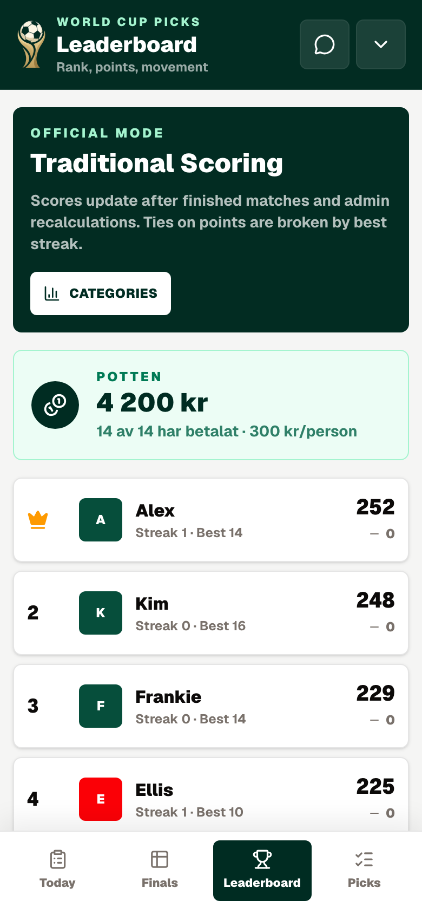
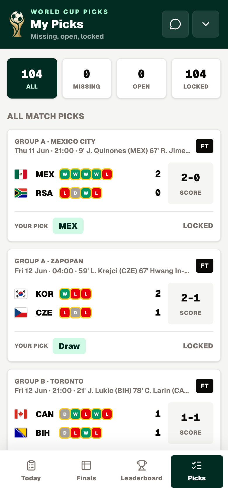
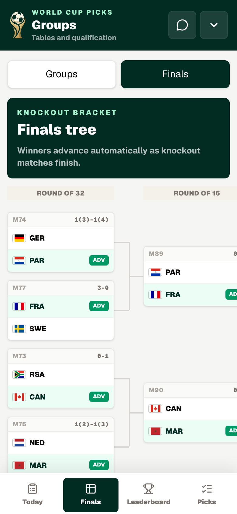
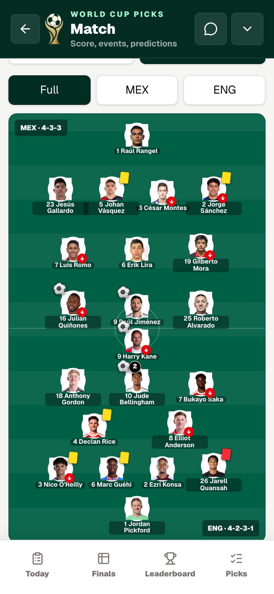

# World Cup Picks

A prediction-pool PWA for the 2026 FIFA World Cup. Friends join a private pool, predict every match, and watch the standings move while games are being played.

**Stack:** Next.js 16 (App Router) · React 19 · TypeScript · Tailwind 4 · Supabase (Postgres, Auth, Edge Functions) · Vercel

## How it was built

The first commit landed on 7 June 2026, four days before the opening match. The deadline was not negotiable: a prediction pool that isn't live before kickoff has no reason to exist.

So it was built in two phases. First, whatever it took to be correct and usable by the first whistle — auth, pools, predictions, the scoring engine, and a sync that could keep up with a live match. Then, once the tournament was running, it was improved against reality: 74 commits in the week around the opening, tapering to targeted fixes as each new situation showed up. Penalty shootouts. Knockout brackets that don't exist until the groups finish. A provider whose standings lag the final whistle by hours.

The last commit is from 15 July, four days before the final. The repo is dormant now — the tournament is over. The interesting part was never the live app anyway, but what it took to keep a leaderboard correct while 104 matches played out.

Most of it was written with AI assistance, which is visible in the commit trailers and is the way I work day to day.

---

## Screenshots

| Pool standings | Your picks |
|---|---|
|  |  |

| Knockout bracket | Line-ups |
|---|---|
|  |  |

Names in the demo and in these screenshots are aliases; the matches, results and
points are real.

**[Take the read-only tour →](https://wc-2026-sepia.vercel.app/demo)** — no account
needed. It opens the real pool with member identities replaced.


---

## What it does

- **Private pools.** Invite-only groups with their own standings, chat, and pot tracking.
- **Two scoring modes.** Traditional fixed points (3 for the right result, +3 for an exact score), or a pot mode where each match's points are split between the players who got it right.
- **Bonus picks.** Top scorer, top assists, finalists, and champion, settled automatically as results come in.
- **Live updates.** Scores, events, and standings move while the match is being played.
- **Deadline notifications.** Web push before kickoff, respecting per-user quiet hours and time zones.
- **Full bracket handling.** Group tables, FIFA's third-place qualification table, and knockout progression.

## Architecture

```
Next.js app (Vercel)
    │
    ├── React Query + localStorage persistence   ← offline-tolerant PWA shell
    │
    ▼
Supabase Postgres   ← row-level security on every table
    ▲
    │
    ├── sync-world-cup              (Edge Function, Supabase Cron)
    │       └── API-Football   ← fixtures, events, player stats, standings
    │
    └── send-deadline-notifications (Edge Function, Supabase Cron)
            └── Web Push → browsers
```

Two scheduled Edge Functions do all the outside work. The Next.js app never talks to the football provider directly — it only reads from Postgres, which keeps the request path fast and the provider quota predictable.

## The parts worth reading

Most of the engineering went into problems that only appear once real matches are running.

**Sub-minute updates on a one-minute scheduler.** Supabase Cron fires at most once per minute, but a goal that lands 20 seconds in shouldn't wait a full minute to show up. The live sync runs four ticks inside a single invocation, sleeping 15 seconds between them — an effective 15-second refresh from one scheduled job.
→ [`supabase/functions/sync-world-cup/index.ts`](supabase/functions/sync-world-cup/index.ts)

**Staying inside the provider's rate limit.** API-Football allows 300 requests per minute. The enrichment scripts batch four calls with a one-second pause, landing around 240/min — enough headroom that a retry never pushes it over.
→ [`scripts/enrich-team-form.mjs`](scripts/enrich-team-form.mjs)

**Not trusting the provider's standings.** Upstream group tables can lag a final whistle by hours. When a match finishes, the sync recalculates group standings from our own stored results instead of waiting, so the table is right in the same minute the game ends.

**Compute budget.** Re-syncing every finished fixture meant 60+ matches × 2 API calls per run, which blew the Edge Function's budget. Post-match sync is scoped to a 48-hour window; older finals are immutable, so refetching them buys nothing.

**FIFA's third-place table.** In the 48-team format, eight of twelve third-placed teams advance, and which Round-of-32 slot each takes depends on *which combination* of groups they came from. That is a lookup table, not a formula.
→ [`src/lib/third-place-allocation.ts`](src/lib/third-place-allocation.ts)

**Quiet hours across time zones.** Deadline pushes respect each user's quiet hours in their own time zone, so a 03:00 kickoff doesn't wake someone who asked not to be woken.
→ [`src/lib/notifications/`](src/lib/notifications/)

## Sync modes

One Edge Function, five modes, each on its own schedule:

| Mode | What it does |
|---|---|
| `live` | Polls live fixtures every 15s; syncs events, player stats, and score snapshots |
| `reference` | Full fixture list and standings, including TBD knockout fixtures |
| `squads` | Squad rosters; populates bonus-pick options for top scorer and assists |
| `post-match` | Refreshes events and player stats for recently finished matches |
| `stats` | Recalculates tournament-wide player stat snapshots |

Every run writes a row to `sync_runs`, so a failed sync is visible rather than silent.

## Testing

```bash
npm test          # 53 unit tests across 14 files (Vitest)
npm run test:e2e  # Playwright
```

Unit tests cover the places where a bug is expensive and invisible: scoring, bonus settlement, group standings, bracket progression, third-place allocation, streaks, and prediction locking.

## Running locally

```bash
npm install
cp .env.example .env.local   # Supabase, API-Football, and VAPID values
npm run dev
```

Open `http://localhost:3000`.

Schema lives in [`supabase/schema.sql`](supabase/schema.sql), with incremental changes in [`supabase/migrations/`](supabase/migrations/). Deployment, scheduling, and Edge Function secrets are documented in [`docs/operations.md`](docs/operations.md). Product scope is in [`docs/implementation-plan.md`](docs/implementation-plan.md).

## Notes

The logo is AI-generated and carries C2PA provenance metadata, which is why `logo.png` has an embedded signing chain.

## License

© 2026 Miguel Barajas Lamo. All rights reserved.

This repository is published so the code can be read and reviewed. It is not
licensed for reuse, redistribution, or derivative works.
